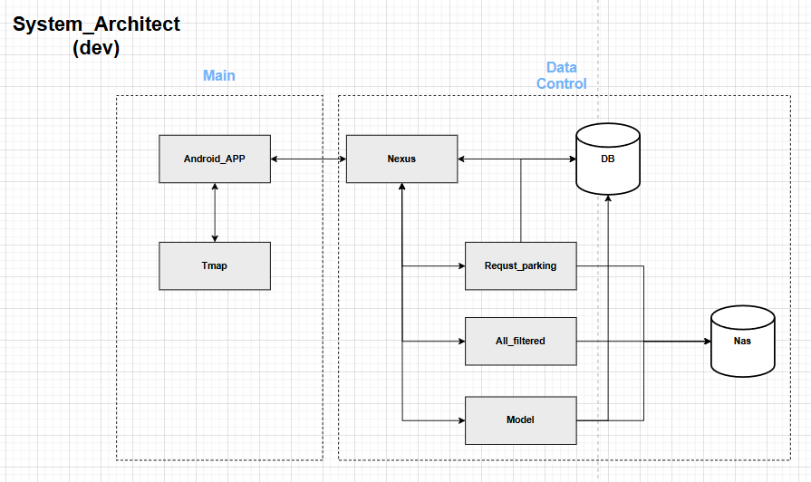

# 내비서(TmapProject)
## 한국공학대학교 졸업작품

## 목차
1. [👥 팀원 소개](#-팀원-소개)
2. [🛠️ Tech Stacks](#-Tech-Stacks)
3. [🤝 협업 전략](#-협업-전략)
4. [📖 그라운드 룰](#-그라운드-룰)
5. [🗂️ Components Architecture Diagram](#%EF%B8%8F-components-architecture-diagram)
6. [🗺️ Route](#%EF%B8%8F-route)
7. [🚀 주요 개발 사항](#-주요-개발-사항)
8. [🔗 링크 모음](#-링크-모음)

## 👥 팀원 소개
<table >
  <tbody>
      <td align="center">
        <a href="https://github.com/kokohuhusave">
            
<h3><b>김준호</b></h3></a></td>
        <td align="center">
        <a href="https://github.com/MINLEE-HO">
            
<h3><b>이민호</b></h3></a></td>
        <td align="center">
        <a href="https://github.com/koyj115">
            
<h3><b>고영진</b></h3></a></td>
        <td align="center">
        <a href="https://github.com/kyunghs">
            
<h3><b>경혁수</b></h3></a></td>
  </tbody>
</table>

## 🛠️ Tech Stacks

### Cowork Tools


### Development


### Model


### IDEs/Editors


### Deploy


## 🤝 협업 전략
# 🎯 Issue Template

## 11월 13일 수요일 회의

### 앞으로 해야 하는 작업 리스트

1. XML 작업
    1. XML에 대한 Activity 작업 (로그인, 회원가입, 사용기록, 사용자정보 등에 대한 CRUD)
2. 티맵 API
    1. 티맵 API 시스템 상단에 내비서 인터페이스 작업(남은 자리 안내 위젯, TTS, STT, 다른 경로 추천 등의 동작)
3. 플라스크(Python)
    1. 모델 생성 스케줄링
    2.  POST 요청에 대한 DB 서버 접근(쿼리)

---

### 1차 기한 ~ 11월 20일(수요일)까지

- 경혁수 : 티맵 API단 60 ~ 70% 완성 정도를 목표
- 고영진 : 바텀슬라이드 및 XML 작업 완료 목표
- 김준호 : XML 작업 완료 목표
- 이민호 : Flask 및 모델에 대한 스케줄링 완료 목표

---

### 1차 기한 이후 계획

- 경혁수 : 티맵 API 관련 기능 완성 계획
- 고영진 : 미비된 XML 보완 및 Activity 작업
- 김준호 : 미비된 XML 보완 및 Activity 작업
- 이민호 : 유저 Activity 작업 or 티맵 API 관련 Activity 작업


### PR Template
```
## 🎯 이슈 번호

## 💡 작업 내용

- [x] 작업 내용

## 💡 자세한 설명

## 📗 참고 자료 (선택)

## 📢 리뷰 요구 사항 (선택)

## 🚩 후속 작업 (선택)

## ✅ 셀프 체크리스트
```

### Folder Structure
```
Team9-Podo-FE
├── .github                         # Feature, PR, Bug template
├── public                          # public
└── src
    ├── common                        # fonts, images, svg, video resoucres 
    ├── admin                         # 어드민 페이지
    └── client                        # 이벤트 페이지
        ├── api                         # api 호출 Function
        ├── components                  # 페이지를 구성하는 components
        ├── constants                   # api, message, pagination 및 공통적으로 사용되는 constants
        ├── hooks                       # custom hooks        
        ├─- mocks                       # MSW를 활용한 mock data, handler                         
        ├── pages                       # 페이지를 구성하는 레이아웃
        ├── providers                   # Context Provider
        ├── router                      # 라우터           
        ├── styles                      # Global Style
        ├── types                       # 타입       
        ├── utils                       # date, validator 관련 util 함수
```


## 📖 그라운드 룰
* WBS에 적힌 각 요구사항들 기간내에 완수 필요
* Product Backlog를 마일스톤으로 작성함
* 매일 10시 데일리 스크럼을 통해 진행상황을 공유함
* 금요일 오전에 main에 dev를 merge함
* PR은 merge하기 전 서로 리뷰함
* Commit은 Issue task의 작업 크기를 넘지 않도록 함
* 메시지를 확인했다면 최소한 이모지를 사용해서 반응함

## 🗂️ Sequence Diagram


## 🗂️ Flow Chart


## 🗂️ Architect Grad


docs/architect_grad.PNG
## 🔗 링크 모음
### 🎨 디자인
- **디자인**: [Figma](https://www.figma.com/design/tJnqWHKG1KCrNxWSPF2Kvg/Untitled?node-id=0-1&node-type=canvas&t=VmbrXZmhI6g2AOGG-0)
- **초기디자인**: [Wihimsical](https://whimsical.com/examples-3sdG1dCAhozQVkLvy4ixLC)

### 📄 발표 및 보고서
- **발표 PPT**: [Canva](https://www.canva.com/design/DAGC6RP3n74/A05HBoB3-GgFyGaFeOPc5Q/edit)
- **관련 보고서**: [Google Docs](https://docs.google.com/document/d/1lCj0wN8wIg69uIxeoBo5pBCReKXNStDrfcdTOACjSys/edit?tab=t.0)
- **계획서**: [notion](https://pyrite-lemon-590.notion.site/13cccc75e2ec80e08156f9df4b534bd6)
- **작품설명서**: [Canva](https://www.canva.com/design/DAGXlp6Aqkc/MF3wOdzFyTE4wtwzdKvHXA/edit?utm_content=DAGXlp6Aqkc&utm_campaign=designshare&utm_medium=link2&utm_source=sharebutton)

### 📊 데이터
- **서울특별시_시영_주차정보 제공 API**: [Data Link](https://data.seoul.go.kr/dataList/OA-21709/S/1/datasetView.do)
- **한국전력공사_전기차 충전소 운영정보**: [Data Link](https://www.data.go.kr/tcs/dss/selectApiDataDetailView.do?publicDataPk=3068728)

test
  
